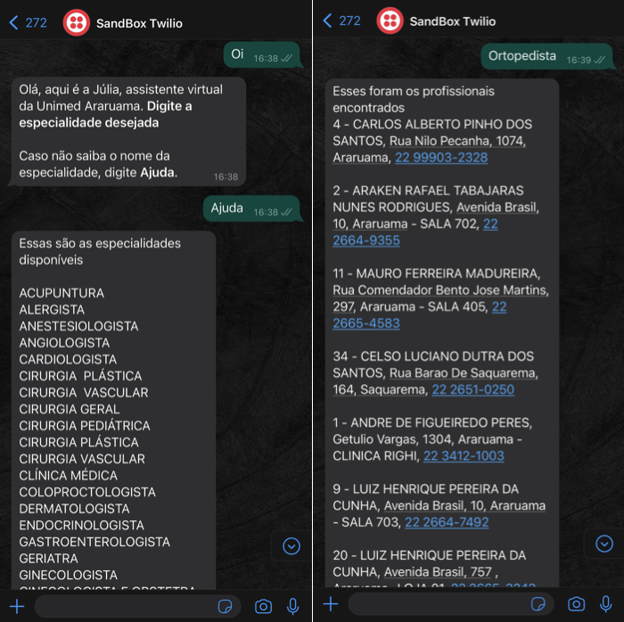
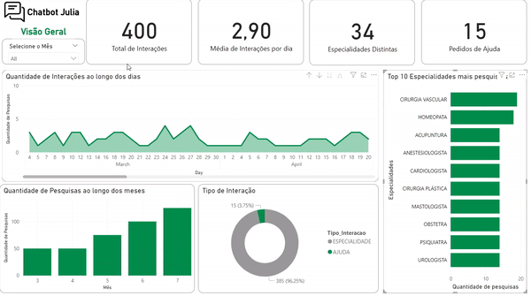

# julia_whatsapp_chatbot

## O Projeto 

Após diversas vezes escutar os pacientes se queixando da dificuldade em marcar uma consulta com especialista, decidi pensar numa maneira de tentar resolver esse problema. E aproveitando que queria treinar/estudar programação através de projetos pessoais, essa me pareceu uma ótima oportunidade de unir ambos. 

A proposta do projeto é desenvolver um Chatbot para WhatsApp que retorna aos pacientes quais são os profissionais daquela especialidade que ele deseja e que atende o seu plano de saúde, neste caso, a Unimed. Além disso, todas as interações são salvas e depois disponibilizadas através de um Dashboard no Power BI. **Para mais detalhes e explicação do projeto**, só ver o [post no Medium](https://alvesleticia.medium.com/todo-m%C3%A9dico-deve-saber-programar-5ba8d490a2c6).

## Requisitos
* Dados: Era preciso ter as informações dos especialistas que atendiam o plano, neste caso a Unimed. Informações necessárias: Especialidade, Nome, Endereço de atendimento, telefone do local de atendimento.
* Chatbot: Twilio + Flask + Ngrok + Editor de Código + Python
* Dashboard: Power BI

## Passo a passo 
1. Coleta de dados dos especialistas
2. Pré-processamento dos dados
3. Desenvolvimento do Chatbot 
  3.1. Twilio 
  3.2. Configurar o ambiente 
  3.3. Flask 
  3.4. Ngrok 
  3.5. [Código](https://github.com/leticiamchd/julia_whatsapp_chatbot/blob/main/main.py) 
4. Gerando as possíveis pesquisas
5. Construindo o Dashboard no Power BI

## Resultado 
### Chatbot 
[Vídeo da demonstração do Chatbot](https://www.youtube.com/watch?v=q_4sdqCpCts) 
 

### Dashboard

---

**Obs.: Essa aplicação não se encontra em funcionamento. Foi apenas um projeto pessoal motivado pelas queixas que encontrei no meu trabalho atual.**
